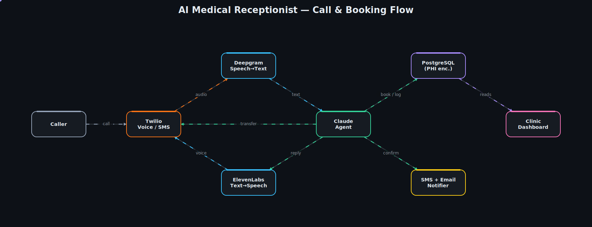

# AI Medical Receptionist

**A 24/7 AI voice receptionist for clinics — answers every call, books and manages appointments, answers common questions, and hands urgent calls to a human.**



> 📽️ A matching animated GIF is in [`assets/architecture.gif`](assets/architecture.gif) — handy to attach to a proposal or pitch.

---

## Overview

Clinics miss calls — after hours, at lunch, when the front desk is swamped — and every missed call is a lost booking. This service answers **100% of inbound calls** with a natural-sounding voice agent that can book, reschedule, and cancel appointments, answer the questions callers actually ask (hours, address, parking, insurance, fees, doctor availability, services), and **warm-transfer to a human** the moment a caller asks for one or the situation sounds urgent.

It's **multi-tenant** by design: one deployment serves many clinics, each with its own phone number, FAQs, business hours, staff logins, and isolated data. Clinic owners manage everything — FAQs, hours, appointments, call history — from an admin dashboard, **without touching code**.

This repository is a **runnable architecture starter**: the real structure, interfaces, and connector seams are all here and wired together, with the vendor integrations stubbed behind clean boundaries and a green test suite proving the core logic.

## Architecture walkthrough

The diagram above maps 1:1 to the code. A call flows left to right:

1. **Caller → Twilio** — Twilio Programmable Voice answers the inbound call and opens a bidirectional media stream ([`telephony/twilio_handler.py`](src/medreception/telephony/twilio_handler.py)).
2. **Twilio → Deepgram (Speech→Text)** — streamed audio is transcribed into finalized utterances ([`voice/stt.py`](src/medreception/voice/stt.py), [`connectors/deepgram_client.py`](src/medreception/connectors/deepgram_client.py)).
3. **→ Claude Agent** — the orchestrator ([`agent/conversation.py`](src/medreception/agent/conversation.py)) runs a tool-use loop with Claude. The model decides when to `check_availability`, `book_appointment`, `answer_faq`, or `transfer_to_human` ([`agent/tools.py`](src/medreception/agent/tools.py)). Promoting these to explicit tools lets us **gate side effects** (booking, transfer) and validate arguments before anything happens.
4. **Agent → ElevenLabs (Text→Speech) → Twilio** — replies are synthesized to a human-like voice and streamed back to the caller ([`voice/tts.py`](src/medreception/voice/tts.py)).
5. **Agent → PostgreSQL** — appointments and call logs are persisted; **patient-identifying fields (PHI) are encrypted at rest** ([`services/appointments.py`](src/medreception/services/appointments.py), [`security/crypto.py`](src/medreception/security/crypto.py)).
6. **Agent → Notifier** — SMS (Twilio) and email (SendGrid) fan out for confirmations, reminders, missed-call alerts, and new-booking alerts ([`services/notifications.py`](src/medreception/services/notifications.py)).
7. **Agent → Twilio (transfer)** — on `transfer_to_human`, the call is warm-transferred to the clinic's fallback number ([`telephony/call_transfer.py`](src/medreception/telephony/call_transfer.py)).
8. **PostgreSQL → Dashboard** — the tenant-scoped admin API serves appointments, call history, FAQs, hours, and usage stats ([`dashboard/api.py`](src/medreception/dashboard/api.py)).

## Tech stack

| Concern | Choice |
| --- | --- |
| API / webhooks | **FastAPI** + Uvicorn |
| Telephony & SMS | **Twilio** Programmable Voice + Messaging |
| Speech-to-text | **Deepgram** (streaming) |
| Text-to-speech | **ElevenLabs** |
| Conversation brain | **Anthropic Claude** (tool use) — default `claude-haiku-4-5` |
| Data store | **PostgreSQL** + SQLAlchemy 2.0 (row-level `clinic_id` multi-tenancy) |
| Email | **SendGrid** |
| Security | Fernet PHI encryption, bcrypt + JWT auth |

> **Model choice.** On a live phone call, sub-second latency matters more than raw capability, so the real-time turn defaults to `claude-haiku-4-5` (see `LLM_MODEL` in [`.env.example`](.env.example)). Swap to `claude-sonnet-5` for tougher triage prompts where latency is looser — it's a single env var.

## Project structure

```
ai-medical-receptionist/
├── src/medreception/
│   ├── main.py               # FastAPI app — wires telephony + dashboard
│   ├── config.py             # env-driven settings (no hardcoded secrets)
│   ├── db.py                 # SQLAlchemy engine + session
│   ├── models.py             # multi-tenant schema (Clinic, Appointment, Faq, CallLog…)
│   ├── telephony/            # Twilio inbound webhook + warm transfer
│   ├── voice/                # STT / TTS façades
│   ├── agent/                # Claude tool-use orchestrator + tool schemas
│   ├── services/             # appointments, FAQ, notifications (business logic)
│   ├── connectors/           # client wrappers: Anthropic, Twilio, Deepgram, SendGrid
│   ├── dashboard/            # tenant-scoped admin REST API
│   └── security/             # PHI encryption + auth (bcrypt, JWT)
└── tests/                    # pytest suite (booking, FAQ, agent tools)
```

## Getting started

**Prerequisites:** Python 3.11+, PostgreSQL (SQLite is used for tests), and accounts for Twilio, Deepgram, ElevenLabs, SendGrid, and Anthropic.

```bash
# 1. Install
make install                # pip install -e ".[dev]"

# 2. Configure
cp .env.example .env
# generate a PHI key:
python -c "from cryptography.fernet import Fernet; print(Fernet.generate_key().decode())"
# paste it into PHI_ENCRYPTION_KEY, then fill in the API keys

# 3. Run
make run                    # uvicorn medreception.main:app --reload --app-dir src
```

Point your Twilio number's voice webhook at `POST https://<your-host>/telephony/incoming`.

## Testing

```bash
make test        # pytest -q
```

The suite runs against in-memory SQLite and passes on the stubs — it verifies PHI is encrypted before storage, that slot availability excludes booked times, FAQ upsert semantics, and that the agent's tool schemas and dispatch (including the human-transfer signal) are correct.

## Roadmap — what a full build adds

The seams are in place; a production build fills them in:

- **Live media bridge** — complete the Deepgram live socket and ElevenLabs streaming with barge-in / interruption handling for natural turn-taking.
- **Real scheduling** — replace naive 30-min slots with per-clinic calendars, provider availability, timezones, and double-booking guards; optional EHR/calendar sync (Google, Cal.com).
- **Reminders & missed-call jobs** — a scheduled worker (e.g. Celery/APScheduler) driving reminder and missed-call flows off `services/notifications.py`.
- **Dashboard frontend** — a React/Next.js UI on top of the existing tenant-scoped API; FAQ and hours editors.
- **Compliance hardening** — HIPAA posture: audit logging, BAAs with each vendor, key rotation/KMS, RBAC, data-retention policies.
- **Observability & tests** — call-quality metrics, structured logs, load testing for concurrent calls, and integration tests against vendor sandboxes.

---

*Starter architecture by Arpit Singh — Senior AI & Data Engineer.*
